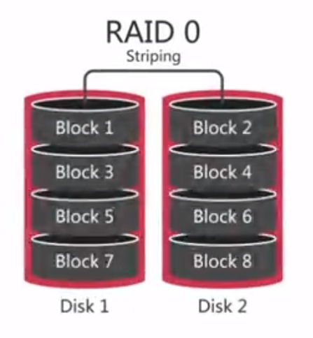
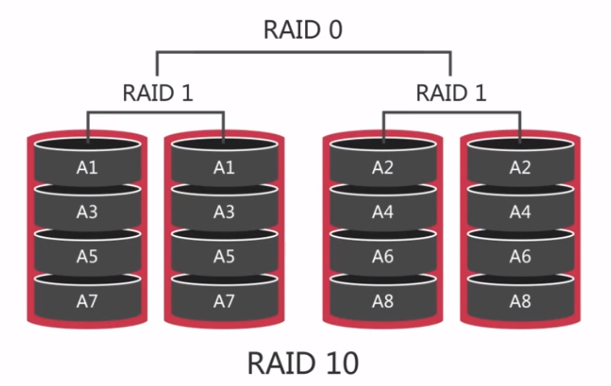
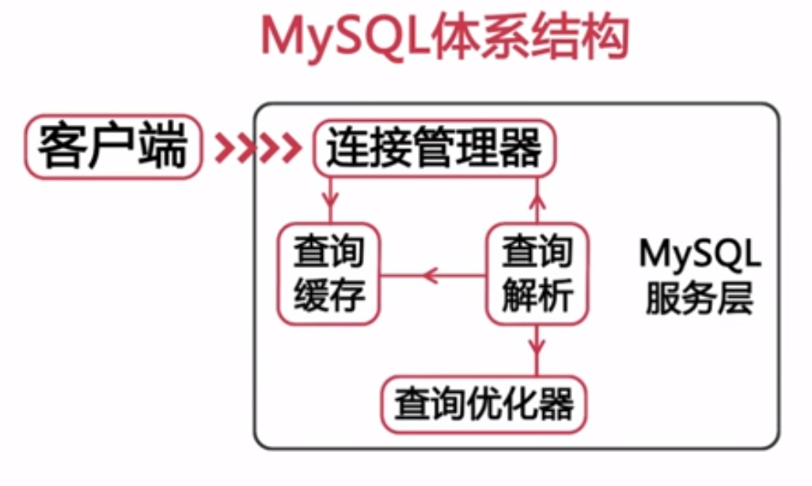
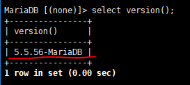
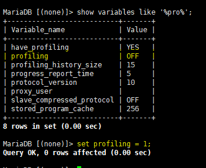
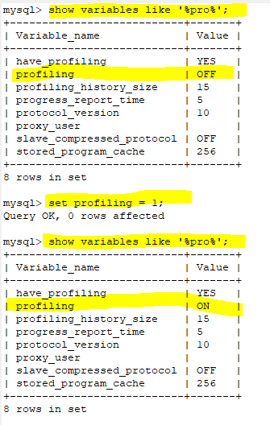

# MySQL 架构性能调优

## MySQL性能问题

- Web服务器横向发展
- 数据库服务器
  - Master(1)/Slave(15)
    - Master 故障，没有高可靠性
- 数据库影响原因(CPU:64 core, Mem: 512GB)
  - QPS(Query Per Second) & TPS(transaction per second)代表每秒执行的事务数量
  - 并发请求/CPU idle
  - 磁盘IO

- SQL 查询速度
- 服务器硬件（CPU/内存/磁盘IO/网卡流量）

### 1. 超高的 QPS/TPS

> QPS：每秒中处理的查询量
- 风险：效率底下的SQL

- CPU 10ms 处理 1个SQL
- 1s 处理 100个sql
- QPS <= 100

- 100ms 处理 1个sql
- QPS <= 10

### 2. 大量的并发和超高的CPU使用

- 风险
- 大量的并发：数据库连接数被占满（MySQL：max_connection 默认100）
- 超高的CPU使用率：CPU 资源耗尽而出现宕机

- 并发量：同一时间数据库处理的业务适量
- 连接数：同一时间连接数据库

### 3. 磁盘IO

- 风险：
  - 磁盘IO性能突然下降（解决：使用更快的磁盘设备）
    - 更好的raid卡
    - SSD
    - fashion IO
  - 其他大量消耗磁盘性能的计划任务（调整计划任务，做好磁盘维护）
    - 备份

### 4. 网卡流量

- 风险: 网卡IO被占满（1000Mb/8 = 100MB）
- solution:
  - 减少从服务器的数量
  - 进行分级缓存
  - 避免使用 `select *` 进行查询
  - 分离业务网络和服务器网络

### 5. 大表带来的性能问题

- 记录行数巨大，单表超过千万行
- 表数据文件巨大，表数据文件查过10G

- 大表对查询的影响
  - 慢查询：很难在一定的时间内过滤出所需要的数据
  - buy_logs 订单日志
  - 查询京东订单：
    - 显示订单
    - 来源少
    - 区分度低
    - 大量磁盘IO
    - 降低磁盘效率
    - 大量慢查询

- 大表对DDL操作的影响
  - 建立索引需要很长的时间：风险
    - MySQL < 5.5 建立索引会锁表
    - MySQL >= 5.5 不会锁表，但会引起主从延迟
    - MySQL 5.6 多线程复制
  - 修改表结构需要长时间锁表
    - 会造成时间的主从延迟
    - 影响正常数据操作，阻塞业务数据操作

- 处理数据库中的大表
  - 分库分表版一张大表分成多个小表
  - 难点：
    - 分表主键的选择
    - 分表后跨分区数据的查询和统计
  - 大表的历史数据归档**减少对前后端业务的影响**
  - 难点：
    - 归档时间点的选择： 一年前(订单)，一个月(日志)
    - 如何进行归档操作

### 6. 大事务带来的性能问题

> 事务是数据库系统区别于其他一切文件系统的重要特性之一
> 事务是一组具有原子性的SQL语句，或是一个独立的工作单元

- 事务特性
  - 原子性
  - 一致性
  - 隔离性
  - 持久性

#### 6.1 事务的原子性(ATOMICITY)

> 一个事务必须被视为一个不可分割的最小工作单元这个歌事务中的所有操作要么全部提交成功，要么全部失败，对于一个事务来说，不可能只执行其中的一部分操作

- 举例银行转账问题：A转账给B，2000元
  - A账户是否有2000元
  - 如果有大于2000元余额，A账户余额减去2000元
  - B账户余额增加2000元
- 整个事务中的所有操作要么全部提交成功，要么全部失败回滚

#### 6.2 事务的一致性(consistency)

> 将数据库从一种一致性状态转换到另外一种一致性状态，在事务开始之前和事务结束后数据库中数据的完整性没有被破坏

- 银行总金额不能变化

#### 6.3 事务的隔离性(isolation)

> 事务对数据库中的数据修改，在未提交完成前对于其他事物是不可见的

- 转账时，有其他业务余额操作对于转账来说是不可见的，也就是说转账是隔离与其他业务

- SQL标准定义的四种隔离级别（隔离性由低到高，并发性由高到低）
  - 未提交的读(Read uncommited) dirty data，脏数据
    - 事务开始到结果之前的操作，对于其他事务来说可见
  - 已提交读(Read commited)
    - 事务开始到结果之前，对于其他事务来说不可见的
    - 不可重复读
  - 可重复读(repeatable read)
    - 同一个事务中，多次读写同样的记录，结果是一致的

  - 可串行化(Serializable)
    - 读取额每一行都加锁，导致大量锁超时，锁征用问题
    - 没有并发的情况下，使用此严格机制

##### 6.3.1 已提交读 与 可重复读区别

- 进程1

``` MYSQL
> select * from t; id={1,3,5,7,9}
> show variables like '%iso%'
> begin;
> select * from t　where id < 7;
id={1,3,5}
```

- 进程2

```MYSQL
> begin;
> insert into t values(2)
> commit;
```

- 进程1

``` MYSQL
> select * from t where id <7
id={1,3,5} 看不到插入的2
> commit;
> set session tx_isolation='read-committed'; - 设置隔离界别
> show variables like '%iso%'
> select * from t where id < 7
id={1,3,5,2}
```

- 进程2

``` MYSQL
> begin;
> insert into t values(4)
> commit;
```

- 进程1

``` MYSQL
> select * from t where id <7
```

- id={1,3,5,2,4} 看到插入的 4

#### 6.4 事务的持久性(durability)

> 事务提交，其所做的修改就会永久保存到数据库中

- 此时及时系统崩溃，已经提交的修改数据也不会丢失

### 7. 什么事大事务

> 运行时间比较长，操作数据比较多的事务

- 风险
  - 锁定太多的数据，造成大量的阻塞和锁超时
  - 回滚时所需时间比较长
  - 执行时间长，容易造成主从延迟

#### 7.1 如何处理大事务

- 避免一次处理太多的数据
- 移除不必要的事务中的 select 操作

## MySQL 影响性能的因素

- 服务器硬件(CPU/内存/磁盘IO)
- 服务器操作系统
  - Windows XP: 并发TCP10个
- 数据库存储引擎的选择
  - 插件式存储引擎
  - MyISAM: 不支持事务，**表级锁**
  - InnoDB: 支持事务，**行级锁**
- 数据库参数配置
- 数据库结构设计和SQL语句
  - **慢查询**
  - SQL 语句的编写和优化

### 1. 影响性能元素之一：CPU资源和可用内存大小

- 计算密集型

- 热数据大小大于可用内存大小时，磁盘I/O成为瓶颈

- 网络I/O，大量数据被查询时，Memeche缓存失效时，产生大量网络传输堵塞，而影响服务器性能

- 升级I/O子系统

- 网络和I/O资源

#### 1.1 如何选择 CPU

- 更多CPU？更块CPU？
- 频率和数量

- Inter Xeon E7-8890 v2
  - 主频：2.5GHz, 核心数量:18核36线程
  - 售价：44488元

#### 1.2 CPU密集型的吗？

- SQL语句处理速度 - 使用更快的CPU
  - MySQL 不支持多 CPU 对同一SQL并发处理
  - 多 CPU 对SQL语句处理没有效果

#### 1.3. 系统的并发量(吞吐量)如何

- 并发解决：CPU越多越好

衡量数据库处理能力的指标

- QPS: 同时处理SQL的数量

- Web 类应用：核心数量比频率重要

#### 1.4 MysQL 的版本

- 老版本对多核CPU支持不好（5.0）
- 5.6+ 对多喝CPU支持改善

#### 1.5 选择32位还是64位置的CPU

- 64位使用32位的服务器的版本

### 2. 内存I/O效率

- SSD
- Fusion-IO

- 数据 > 内存 -> 数据库

#### 2.1 常用的 MySQL 存储引擎

- MyISAM
  - 索引通过内存缓存
  - 数据通过操作系统缓存
- InnoDB
  - 索引/索引都通过内存缓存

- 100G磁盘，256G内存时，不能再对内存增加来提高性能，多余的内存

- CPU ——> [写入]缓存 -> 磁盘

- 磁盘数据 读取 -> 内存(Cache) -> 读取 CPU

- 写入数据现在内存写入:
  - CPU数据 -> 写入到内存 -> 写入到磁盘

- 使用内存缓存，计数器达到一定数量之后一次写入到磁盘

#### 2.2 内存的选择

- 内存的主频：频率越高速度越快
- 主板支持的最大内存频率

- 组成购买升级
- 每个通道的内存：相同品牌、颗粒
- 频率、电压、校验技术和型号
- 单挑容量要进可能大

- 根据数据库大小选择内存
  - 考虑数据增长速度、幅度

### 3. 磁盘的配置和选择

#### 3.1 机器磁盘

- 使用最多
- 价格低
- 存储空间大
- 读写较慢

##### 3.1.1 传统机器硬盘读取数据的过程

1. 移动磁头到磁盘表上的正确位置
2. 等待磁盘旋转，使得所需的数据在磁头之下
3. 等待磁盘旋转过去，所有所需的数据都在被磁头读出

- 访问时间：1，2不所耗费的时间
- 传输速度：3

##### 3.1.2 如何选择传统机器硬盘

1. 存储容量
2. 传输速度（上面第3步骤）
3. 访问时间（上面第1，2步骤）
4. 主轴转速
5. 物理尺寸

### 3.2 raid增强传统及其硬盘的性能

> 磁盘冗余队列的简称
- 把多个容量较小的磁盘组成一组容量更大的磁盘，并提供数据冗余来保证数据完整性的技术

- 
  - 数量 2+
  - 数据分别在不同的磁盘存储
  - 成本低
  - 提高整个磁盘的性能和吞吐量
  - 没有冗余
  - 没有错误修复能力

-  磁盘镜像
  - 镜像文件存储
  - 可靠性
  - 可修复性
  - 容易能力

-  分布式奇偶校验磁盘这列

-  分片镜像

#### 3.2.1 RAID级别选择

- 等级|特点|是否冗余|盘数|读|写
- RAID0|便宜，快速，危险|N|N|块|块
- RAID1|高速度，简单，安全|Y|2|块|慢
- RAID5|安全，成本折中|Y|N+1|块|取决于最慢的盘
- RAID10|贵，高速，安全|Y|N+1|块|块

### 3.3 固态存储SSD和PCIe卡

#### 3.3.1 固态存储：闪存（Flash Memory）

- 特点：
  - 比机械磁盘更好的**随机读写性能**
  - 比机械磁盘更好的**并发**
  - 比机械磁盘更好的**更容易损坏**

#### 3.3.2 SSD：固态硬盘特点

- 使用SATA接口
  - 提花传统磁盘而不需要任何改变
  - SATA 3.0 => 6Gbps
  - SATA 2.0 => 3Gbps
- 支持 RAID

#### 3.3.3 PCIe卡(PCI-E SSD)特点

- 无法使用SATA接口，使用PCI接口）
  - 独特的驱动和配置
- 价格比SSD贵
- 性能比SSD更好

#### 3.3.4 固态存储的使用场景

- 适用于存在大量随机 I/O 的场景
- 解决单线程负载的 I/O 瓶颈

### 3.4 网络存储NAS和SAN

> 两种外部文件存储设备加载到服务器上的方法

- SAN: Storage Area Network
> SAN设备通过光纤链接到服务器，设备通过块接口访问，服务器可以将其当作硬盘使用

- NAS: Network-Attached Storage
> NAS设备使用网络连接，通过基于文件的协议和NFS 或 SMB来访问

- 大量顺序读写
- 不如本地RAID磁盘
- 随机读写慢
- I/O 合并

#### 3.4.1 网络存储使用的场景

- 顺序I/O 适合MySQL
- 数据库备份

### 3.5 网络对性能的影响

- 磁盘：延迟和吞吐量

- 网络性能的限制：延迟/带宽

- 带宽：512k vs 10M

- 数据库服务器 -> Web 服务器
  - 内网：1000M带宽
  - 2M数据
  - 50 Web服务器
  - 满载

- 网络质量对性能的影响

#### 网络对性能的影响的建议

- 采用高性能和高带宽的网络接口设备和交换机
- 对多个网卡绑定，增强可用性和带宽
- 尽可能进行网络隔离

- 服务器硬件对性能影响
  - CPU
    - 64 bit OS
    - 并发：CPU数量
    - CPU密集型：CPU频率
  - 内存
    - 主板支持最高频率的内存
    - 内存大小
  - I/O 子系统
    - PCIe 卡(随机 I/O 系能)
    - SSD (SATA接口)
    - RAID10(数据库)
    - 磁盘
    - SAN

## OS 对性能的影响

### MySQL 适合的操作系统

- Windows(注意与Linux文件系统的大小区分)
- FreeBSD
  - 老版本支持不好
  - 新版本支持很好
- Solaris
- Linux
  - RedHat
  - CentOS
- Ubuntu

### CentOS 系统参数优化

- 《Linux性能优化大师》

#### 内核相关参数: `/etc/sysctl.conf`

> 对于一个TCP连接，Server与Client需要通过三次握手来建立网络连接.当三次握手成功后, 可以看到端口的状态由 LISTEN 转变为 ESTABLISHED, 接着这条链路上就可以开始传送数据了
- 每一个处于监听(Listen)状态的端口, 都有自己的监听队列 

- 收到请求但是没有完成 accept() 的连接总数上限

- 每个 listen 端口队列长度

``` code
net.core.somaxconn=65535
net.core.netdev_max_backlog=65535
net.ipv4.tcp_max_syn_backlog=65535
```

``` code
echo 1000 >/proc/sys/net/core/somaxconn`
```

- 等待状态- TCP 连接回收

``` code
net.ipv4.tcp_fin_timeout = 10
net.ipv4.tcp_tw_reuse = 1
net.ipv4.tcP-tw_recycle = 1
```

- TCP 连接接受和发送缓冲区大小默认值和最大值

```net.core.wmem_default = 87380
net.core.wmem_max = 16777316
net.core.rmem_default = 87380
net.core.rmem_max = 16777216`
```

- 失效连接TCP数量，加快资源回收效率

``` code
net.ipv4.tcp_keepalive_time = 120 keepalive时间间隔：秒
net.ipv4.tcp_keepalive_intvl = 30 
net.ipv4.tcp_keepalive_probes = 3
```

- 内存参数
- 4G

`kernel.shmmax = 429467295`

- 定义单个共享内存段的最大值
- 参数设置足够大，以便能在一个共享内存段下容纳整个的InnoDB缓冲池的大小

- 过低，会存储共享多个内存段，导致系统性能下降

- 64 OS：最大值为物理内存值-1byte
- 建议值位大于物理内存的一半，一般取值大于InnoDB缓冲池的大小即可，可以取物理内存-1byte

`vm.swappiness = 0` 这个参数当内存不足时会对性能产生比较明显的影响

- Linux 系统内存区: `# free -m`

> OS 没有足够的内存时就会将一些虚拟内存写到磁盘的交换分区中这样就会发生内存交换

- 交换分区带来风险
  - 降低 OS的性能
  - 容易造成内存溢出，崩溃，或者被 OS kill掉

- 何时使用交换分区
  - `vm.swappiness=0` 告诉内核除非虚拟内存完全满了，否则不要使用交换区

- 增加资源限制： `/etc/security/limit.conf`
  - 此文件实际上Linux PAM也就是插入式认证模块的配置文件
  - 打开文件数的限制

- 加到 limit.conf 文件末尾

``` code
* soft nofile 65525
* hard nofile 65535

`*`: 对所有用户有效
soft: 当前系统生效的设置（不能比hard高）
hard: 系统中所能设定的最大值
nofile: 所限制的资源是打开文件的最大数目
65535： 限制的数量
```

- 可打开的文件数量增加到65535个亿保证可以打开足够多的文件句柄
- 重启系统才能生效

- 磁盘调度策略（`/sys/block/devname/queue/scheduler`）

``` code
# cat /sys/block/sda/queue/scheduler
# noop anticipatory deadline [cfq]
```

- cfq: 公平策略(桌面级别没有问题)
> cfq 需要插入不必要的请求，导致很差的响应时间

- mysql服务器使用

- **noop**: 电梯式调度策略
> 实现了一个FIFO队列，向电梯的工作方法一样对I/O请求进行组织，当有一个新的请求到来时，他将请求合并到最近的请求之后，一次来保证请求统一介质。NOOP 倾向饿死读而利于写，因此NOOP对于**内存设备、RAM及嵌入式系统**是最好的选择


- **deadline**(截至时间调度策略)
> 确保了一个截止时间内服务请求，这个截至时间是的可调整的，而默认读期限短于写期限。这样就防止了写操作因为不能被读取而饿死的现象，Deadline对数据库类应用是最好的选择。

- **anticipatory**(预料I/O调度策略)
> 本质上与Deadline一样，但在最后一次读操作后，要等待6ms, 才能继续进行对其他I/O请求进行调度。他会在每个6ms中插入新的I/O操作，而会将一些小写入流合并成一个大写入流，用写入延时换取最大的写入吞吐量。AS适合于写入较多的环境，比如文件服务器，AS数据库环境表现很差。

`echo deadline > /sys/block/sda/queue/scheduler`

## 文件系统对性能的影响

- Windows
  - FAT:
  - NTFS:服务器
- Linux
  - ext3
  - ext4
  - xfs: 比ext系列 性能更高

- ext3/4 系统的挂载参数(/etc/fstab)
- data=writeblack | ordered | journal

- **writeback**: 元数据和数据不是同步（**innode最好的选择**）

- **ordered**: 只记录元数据
- 但提供了一致性的保证，在写元数据之前会先写数据，使他们保持一致

- journal: 原子日志行为，将数据最终写入前，先记录到日志当中。对于INNoDB 不适合

- noatime,nodiratime
- 禁止记录文件的访问时间和读取目录的时间
- 可以减少些的操作
- `/dev/sda1/ext4 noatime,nodiratime,data=writeback 1 1`

## MySQL 体系结构



- 插件是存储引擎：数据存储、提取相分离

1. 客户端(CS结构)
- PHP/Java/C API/.Net/Python/ODBC/JDBC

- select语句：如何从文件中获得所要查询的数据，这个具体的实现方式则是由下一层存储引擎层来实现


- 存储引擎针对于表（一个库中的不同国标可以使用不同的存储引擎）

### MyISAM

> MySQL 5.5- 默认的存储引擎

- 系统表
- 临时表：在排序、分组等操作中，当数量超过一定的大小之后，由查询优化器建立的临时表

- MYD 数据文件
- MYI 索引文件

`engine=myisam default charset=utf8`

- f.frm 记录表结构
- f.MYD
- f.MYI

#### 特性

- 表级锁：修改时枷锁，读取是共享锁
  - 并发性：不太好
- 表损坏修复：可能造成数据的丢失
  - 检查：`check table tablename`
  - 修复：`repaire table tablename`	

``` mysql
mysql> create table myisam(id int, varchar(10)) engine=myisam
# ls -l mysam
```

``` mysql
mysql> check table myisam
mysql> repaire table myisam
```

- myisam 修复（需要停止mysql服务）：`# myisamchk`

- 支持的索引类型
  - 全文索引
  - text,blob支持索引
- 支持数压缩
  - 适合只读表
  - 可以减少磁盘I/O
  - `myisampack` 压缩命令
  - `# myisampack -b -f myisam.MYI`
  - 插入操作：insert into myisam values(1,'ab')

#### MyISAM 限制

- < MySQL 5.0 时默认表大小为4G
- 存储大表则要修改 `MAX_Rows` 和 `AVG_ROW_LENGTH`
- 大于 5.0 版本默认支持 256TB

#### MyISAM 使用场景

- 非事务型应用
- 只读类应用
- 空间类应用

### InnoDB 引擎

> MySQL 5.5 及之后版本默认存储引擎

- InnoDB使用表空间 数据存储
- innodb_file_per_table
  - on: 独立表空间：tablename.ibd
  - off: 系统表空间：ibdataX

- 查看innodb_file_per_table

``` mysql
show variables like 'innodb_file_per_table'
```

``` mysql
CREATE TABLE myinnodb(
  id int,
  c1 varchar(10)
) engine='innodb'
```

`# ls -lh myinnodb*`

``` mysql
set global innodb_file_per_table=off;
show variables like 'innodb_file_per_table';
create table myinnodb_g(
  id int,
  c1 varchar(10)
) engine='innodb'
```

`# ls -lh myinnodb*`

文件存储在 ibdataX中

#### 系统表空间和独立表空间要如何选择

- 比较
  - 系统表空间无法简单的收缩文件大小
  - 独立表空间可以通过 optimize table 命令收缩文件大小
- IO性能
  - 系统表空间会产生 IO 瓶颈
  - 独立表空间可以同时向多个文件刷新数据
- 建议
  - 对 InnoDB 使用独立表空间

表转移的步骤： 把原来存储在与系统表空间中的表转移到独立表空间中的方法

1. 使用 mysqldump 导出所有数据库表数据
2. 停止 mysql 服务，修改参数，并删除 InnoDB 相关文件
3. 重启 MySQL 服务，重建 InnoDB 系统表空间
4. 重新导入数据

#### innodb 数据字典信息

#### Undo 回滚段（mysql-5.6+开始支持）

### InnoDB 存储引擎的特性

- InnoDB 是一种事务性存储引擎
- 完全支持事务的 ACID 特性
- Redo Log 和 Undo Log

``` mysql

redo log 是已经提交的事务
redo log 缓冲区大小，字节单位；每个一秒刷新，所有不需要配置太大
> show variables like 'innodb_log_buffer_size';

ib_logfile[0-9]* 是

> show variables like 'innodb_log_files_in_group'; 输出value 为2,生成2个 ib_logfile[0-9] 文件

Undo log 是未提交的事务；rollback 是在 undo log 日志文件中查找

```

- innodb 支持行级锁
  - 行级锁可以最大程度的支持并发
  - 行级锁是有存储引擎层实现的

#### 什么事锁

> 管理共享资源的并发访问；锁用于实现事务的隔离性

- 锁的类型
  - 共享锁（读锁）
  - 独占锁（写锁）

|  | 写锁 | 读锁 |
|--|-----| ---- |
| 写锁 | 不兼容 | 不兼容 |
| 读锁 | 不兼容 | 兼容 |

``` client1
> desc myinnodb;
> insert into myinnodb values(2,'bb'),(3,'cc');
> select * from myinnodb;
> begin;
> update myinnodb set c1='bbbb' where id=2; 独占锁
```

``` client2
> use test;
> select * from myinnodb where id = 2; 查看的是 undo log 日志的内容
bb 说明没有更新

```

- 锁的粒度
  - 表级锁
  - 行级锁（开销比表级锁多）

表级锁演示

``` client1
> rollback;
> show create table myinnodb;
> lock table myinnodb write; 表级的独占锁

```

··· client2
> select * from myinnodb; 这个操作被阻塞了
···

``` client1
> unlock tables;
```

··· client2
> select * from myinnodb; 这个操作可以运行
···


## INT/TIMESTAMP/DATETIME 性能效率比较

### 查看 mysql 语句运行时间

#### 1. show profiles

1. Show profiles是5.0.37之后添加的，要想使用此功能，要确保版本在5.0.37之后

Query Profiler是MYSQL自带的一种query诊断分析工具，通过它可以分析出一条SQL语句的性能瓶颈在什么地方。通常我们是使用的explain,以及slow query log都无法做到精确分析，

但是Query Profiler却可以定位出一条SQL语句执行的各种资源消耗情况，比如CPU，IO等，以及该SQL执行所耗费的时间等。

查看数据库版本方法：`show variables like "%version%";`  或者  `select version();`



2. 确定支持show profile 后，查看profile是否开启，数据库默认是不开启的。变量profiling是用户变量，每次都得重新启用。

查看方法： `show variables like "%pro%";`

设置开启方法： `set profiling = 1;`



3.可以开始执行一些想要分析的sql语句了，执行完后，show profiles；即可查看所有sql的总的执行时间。


`show profile for query 1` 即可查看第1个sql语句的执行的各个操作的耗时详情。

`show profile cpu, block io, memory,swaps,context switches,source for query 6;` 可以查看出一条SQL语句执行的各种资源消耗情况，比如CPU，IO等

`show profile all for query 6` 查看第6条语句的所有的执行信息。

#### 2. timestampdiff来查看执行时间。

这种方法有一点要注意，就是三条sql语句要尽量连一起执行，不然误差太大，根本不准

``` mysql
set @d=now();
select * from comment;
select timestampdiff(second,@d,now());
```

如果是用命令行来执行的话，有一点要注意，就是在 `select timestampdiff(second,@d,now());`后面，一定要多`copy`一个空行，不然最后一个sql要你自己按回车执行，这样就不准了。

### 建立表

[SQL 文件](./source/bannerTest.sql)

### 插入100万条测试数据

[PHP 执行文件](./source/index.php)

### 第一种情况，MyISAM引擎， hits_time_i/hits_time_t/hits_time_d这三个字段都没有索引



搜索 2017-05-01 00:00:00(1493568000) ~ 2017-08-01 00:00:00(1501516800) 数据

**int 数据类型数值和 `UNIX_TIMESTAMP` 函数比较**: 效率还可以

``` mysql
mysql> SELECT SQL_NO_CACHE COUNT(id) FROM `banner_hits_myi` WHERE hits_time_i > 1493568000 AND hits_time_i < 1501516800;
+-----------+
| COUNT(id) |
+-----------+
|    428671 |
+-----------+
1 row in set

mysql> SELECT SQL_NO_CACHE COUNT(id) FROM `banner_hits_myi` WHERE hits_time_i > UNIX_TIMESTAMP('2017-05-01 00:00:00') AND hits_time_i < UNIX_TIMESTAMP('2017-08-01 00:00:00');
+-----------+
| COUNT(id) |
+-----------+
|    428671 |
+-----------+
1 row in set

mysql> SHOW PROFILES;
+----------+------------+-----------------------------------------------------------------------------------------------------------------------------------------------------------+
| Query_ID | Duration   | Query                                                                                                                                                     |
+----------+------------+-----------------------------------------------------------------------------------------------------------------------------------------------------------+
|        1 | 0.1631344 | SELECT SQL_NO_CACHE COUNT(id) FROM `banner_hits_myi` WHERE hits_time_i > 1493568000 AND hits_time_i < 1501516800                                                       |
|        2 |  0.16506674 | SELECT SQL_NO_CACHE COUNT(id) FROM `banner_hits_myi` WHERE hits_time_i > UNIX_TIMESTAMP('2017-05-01 00:00:00') AND hits_time_i < UNIX_TIMESTAMP('2017-08-01 00:00:00') |
+----------+------------+-----------------------------------------------------------------------------------------------------------------------------------------------------------+
2 rows in set
```

0.1631344(数值比较) ： 0.16506674(UNIX_TIMESTAMP 内置函数比较)

**timestamp 类型，使用 `UNIX_TIMESTAMP`内置函数查询率很高几乎和 `int` 相当；直接和日期比较效率低**

``` mysql
0.68288615 | SELECT SQL_NO_CACHE COUNT(id) FROM `banner_hits_myi` WHERE hits_time_t > '2017-05-01 00:00:00' AND hits_time_t < '2017-08-01 00:00:00'                                 |
0.1829902 | SELECT SQL_NO_CACHE COUNT(id) FROM `banner_hits_myi` WHERE UNIX_TIMESTAMP(hits_time_t) > 1493568000 AND UNIX_TIMESTAMP(hits_time_t) < 1501516800

```

**对于datetime类型，使用 `UNIX_TIMESTAMP` 内置函数查询效率很低，不建议；直接和日期比较，效率还行**

``` mysql
0.24743755 | SELECT SQL_NO_CACHE COUNT(id) FROM `banner_hits_myi` WHERE hits_time_d > '2017-05-01 00:00:00' AND hits_time_d < '2017-08-01 00:00:00'                                 |
1.03293499 | SELECT SQL_NO_CACHE COUNT(id) FROM `banner_hits_myi` WHERE UNIX_TIMESTAMP(hits_time_d) > 1493568000 AND UNIX_TIMESTAMP(hits_time_d) < 1501516800  
```

### 第二种情况，MyISAM引擎， d_int/d_timestamp/d_datetime这三个字段都有索引

**对于int类型，有索引的效率反而低了，飘易的猜测是由于设计的表结构问题，多了索引，反倒多了一个索引查找**

``` mysql
0.16651908 | SELECT SQL_NO_CACHE COUNT(id) FROM `banner_hits_myi_index` WHERE hits_time_i > 1493568000 AND hits_time_i < 1501516800                                                       |
0.16491253 | SELECT SQL_NO_CACHE COUNT(id) FROM `banner_hits_myi_index` WHERE hits_time_i > UNIX_TIMESTAMP('2017-05-01 00:00:00') AND hits_time_i < UNIX_TIMESTAMP('2017-08-01 00:00:00') |
```

**对于timestamp类型，有没有索引比较日期性能差，UNIX_TIMESTAMP 性能好**

``` mysql
0.6756697 | SELECT SQL_NO_CACHE COUNT(id) FROM `banner_hits_myi_index` WHERE hits_time_t > '2017-05-01 00:00:00' AND hits_time_t < '2017-08-01 00:00:00'                                 |
0.18334677 | SELECT SQL_NO_CACHE COUNT(id) FROM `banner_hits_myi_index` WHERE UNIX_TIMESTAMP(hits_time_t) > 1493568000 AND UNIX_TIMESTAMP(hits_time_t) < 1501516800  
```

**对于datetime类型，有索引反而效率低了**

``` mysql
0.25610888 | SELECT SQL_NO_CACHE COUNT(id) FROM `banner_hits_myi_index` WHERE hits_time_d > '2017-05-01 00:00:00' AND hits_time_d < '2017-08-01 00:00:00'                                 |
1.0239384 | SELECT SQL_NO_CACHE COUNT(id) FROM `banner_hits_myi_index` WHERE UNIX_TIMESTAMP(hits_time_d) > 1493568000 AND UNIX_TIMESTAMP(hits_time_d) < 1501516800  
```

### 第三种情况，InnoDB引擎， d_int/d_timestamp/d_datetime这三个字段都没有索引

**InnoDB引擎的查询效率明细比MyISAM引擎的低，低3倍+**

``` mysql
0.45530221 | SELECT SQL_NO_CACHE COUNT(id) FROM `banner_hits_inn` WHERE hits_time_i > 1493568000 AND hits_time_i < 1501516800                                                             |
0.19749118 | SELECT SQL_NO_CACHE COUNT(id) FROM `banner_hits_inn` WHERE hits_time_i > UNIX_TIMESTAMP('2017-05-01 00:00:00') AND hits_time_i < UNIX_TIMESTAMP('2017-08-01 00:00:00')
```

**对于timestamp类型，使用UNIX_TIMESTAMP内置函数查询效率同样高出直接和日期比较。**

``` mysql
0.71391034 | SELECT SQL_NO_CACHE COUNT(id) FROM `banner_hits_inn` WHERE hits_time_t > '2017-05-01 00:00:00' AND hits_time_t < '2017-08-01 00:00:00'                                       |
0.21356422 | SELECT SQL_NO_CACHE COUNT(id) FROM `banner_hits_inn` WHERE UNIX_TIMESTAMP(hits_time_t) > 1493568000 AND UNIX_TIMESTAMP(hits_time_t) < 1501516800  
```

**对于datetime类型，直接和日期比较，效率高于UNIX_TIMESTAMP内置函数查询。**

``` mysql
0.27987128 | SELECT SQL_NO_CACHE COUNT(id) FROM `banner_hits_inn` WHERE hits_time_d > '2017-05-01 00:00:00' AND hits_time_d < '2017-08-01 00:00:00'
1.11265201 | SELECT SQL_NO_CACHE COUNT(id) FROM `banner_hits_inn` WHERE UNIX_TIMESTAMP(hits_time_d) > 1493568000 AND UNIX_TIMESTAMP(hits_time_d) < 1501516800
```

### 第四种情况: InnoDB引擎， d_int/d_timestamp/d_datetime这三个字段都有索引

**InnoDB引擎有了索引之后，性能较MyISAM有大幅提高。**

``` mysql
0.20441357 | SELECT SQL_NO_CACHE COUNT(id) FROM `banner_hits_inn_index` WHERE hits_time_i > 1493568000 AND hits_time_i < 1501516800
0.09184275 | SELECT SQL_NO_CACHE COUNT(id) FROM `banner_hits_inn_index` WHERE hits_time_i > UNIX_TIMESTAMP('2017-05-01 00:00:00') AND hits_time_i < UNIX_TIMESTAMP('2017-08-01 00:00:00')
```

**对于timestamp类型，有了索引，反倒不建议使用MYSQL内置函数UNIX_TIMESTAMP查询了**

``` mysql
0.45242832 | SELECT SQL_NO_CACHE COUNT(id) FROM `banner_hits_inn_index` WHERE hits_time_t > '2017-05-01 00:00:00' AND hits_time_t < '2017-08-01 00:00:00'
0.26492405 | SELECT SQL_NO_CACHE COUNT(id) FROM `banner_hits_inn_index` WHERE UNIX_TIMESTAMP(hits_time_t) > 1493568000 AND UNIX_TIMESTAMP(hits_time_t) < 1501516800
```

**对于datetime类型，同样有了索引，反倒不建议使用MYSQL内置函数UNIX_TIMESTAMP查询了。**

``` mysql
0.14074116 | SELECT SQL_NO_CACHE COUNT(id) FROM `banner_hits_inn_index` WHERE hits_time_d > '2017-05-01 00:00:00' AND hits_time_d < '2017-08-01 00:00:00'
1.09769958 | SELECT SQL_NO_CACHE COUNT(id) FROM `banner_hits_inn_index` WHERE UNIX_TIMESTAMP(hits_time_d) > 1493568000 AND UNIX_TIMESTAMP(hits_time_d) < 1501516800
```

<table border="1">
<tr>
  <th colspan="2">查询时间20次(秒)</th>
  <th colspan="2" align="center">int</th>
  <th colspan="2" align="center">timestamp</th>
  <th colspan="2" align="center">datetime</th>
</tr>
<tr>
<tr>
  <td></td>
  <td></td>
  <td>UNIX_TIMESTAMP</td>
  <td>直接和时间比较</td>
  <td>UNIX_TIMESTAMP</td>
  <td>直接和时间比较</td>
  <td>UNIX_TIMESTAMP</td>
  <td>直接和时间比较</td>
</tr>
<tr>
<td>MyISAM</td>
<td>无索引</td>
<td style="background:green;color:#fff">0.16506674</td>
<td style="background:green;color:#fff">0.1631344</td>
<td style="background:green;color:#fff">0.1829902</td>
<td style="background:orange;color:#fff">0.68288615</td>
<td style="background:red;color:#fff">1.03293499</td>
<td style="background:blue;color:#fff">0.24743755</td>
</tr>
<td>MyISAM</td>
<td>有索引</td>
<td style="background:green;color:#fff">0.16491253</td>
<td style="background:green;color:#fff">0.16651908</td>
<td style="background:green;color:#fff">0.18334677 </td>
<td style="background:orange;color:#fff">0.6756697</td>
<td style="background:red;color:#fff">1.0239384</td>
<td style="background:blue;color:#fff">0.25610888</td>
</tr>
<tr>
<td>InnoDB</td>
<td>无索引</td>
<td style="background:blue;color:#fff">0.19749118</td>
<td style="background:orange;color:#fff">0.45530221</td>
<td style="background:blue;color:#fff">0.21356422</td>
<td style="background:orange;color:#fff">0.71391034</td>
<td style="background:red;color:#fff">1.11265201</td>
<td style="background:blue;color:#fff">0.27987128</td>
</tr>
<td>InnoDB</td>
<td>有索引</td>
<td style="background:green;color:#fff">0.09184275</td>
<td style="background:blue;color:#fff">0.20441357</td>
<td style="background:blue;color:#fff">0.26492405</td>
<td style="background:orange;color:#fff">0.45242832</td>
<td style="background:red;color:#fff">1.09769958</td>
<td style="background:green;color:#fff">0.14074116</td>
</tr>
</table>

对于MyISAM引擎，不建立索引的情况下（推荐），效率从高到低： int(时间) > UNIX_TIMESTAMP(int) > UNIX_TIMESTAMP(timestamp) > datetime（直接和时间比较）>timestamp（直接和时间比较）>UNIX_TIMESTAMP(datetime) 。

对于MyISAM引擎，建立索引的情况下，效率从高到低： UNIX_TIMESTAMP(int) > int > UNIX_TIMESTAMP(timestamp) >  datetime（直接和时间比较）>timestamp（直接和时间比较）>UNIX_TIMESTAMP(datetime) 。

对于InnoDB引擎，没有索引的情况下(不建议)，效率从高到低： UNIX_TIMESTAMP(int) > int > UNIX_TIMESTAMP(timestamp) > datetime（直接和时间比较） > timestamp（直接和时间比较）> UNIX_TIMESTAMP(datetime)。

对于InnoDB引擎，建立索引的情况下，效率从高到低： UNIX_TIMESTAMP(int) >  datetime（直接和时间比较） >  int > UNIX_TIMESTAMP(timestamp) > timestamp（直接和时间比较）>  UNIX_TIMESTAMP(datetime)。

一句话，对于MyISAM引擎，采用 UNIX_TIMESTAMP(timestamp) 比较；对于InnoDB引擎，建立索引，采用 int 或 datetime直接时间比较。


## MySQL 基准测试-测量系统性能

### 基准测试

> 测量和评估软件性能指标的活动用于建立某个时刻的性能基准，以便当系统发生软硬件变化时重新进行基准测试以评估变化对性能的影响

- 基准测试：（系统系能，忽略逻辑业务性能）
  - 直接、简单、易于比较，用于评估服务器的处理能力

- 对系统设置的压力测试
  - 对真实的业务数据进行测试，获得真实系统所能承受的压力

- 压力测试需要针对不同主题，所使用的数据和查询也是真实用到的

- 基准测试不关心业务逻辑，所使用的查询和业务的真实性可以和业务环境没有关系